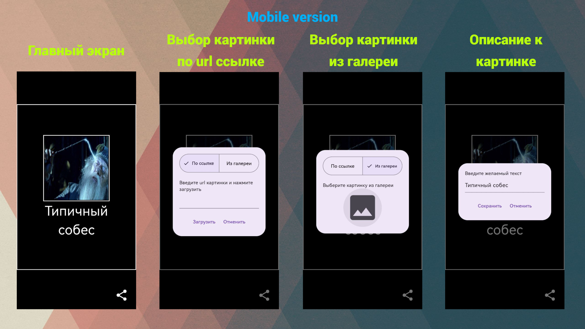
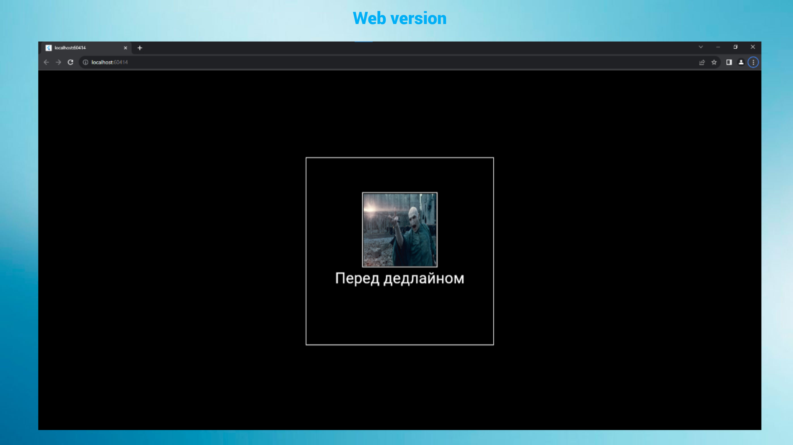
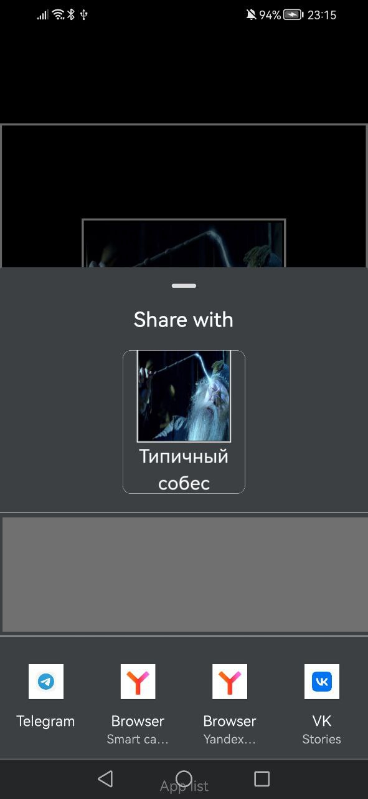

# surf-flutter-study-jam-5

# Showcase

Демонстрация печальных результатов:
---

---
Загрузка картинок из сети работает только с отключенной защитой:\
flutter run -d chrome --web-browser-flag "--disable-web-security"

---

# Проделанная работа

Базовый уровень:\
✔️ возможность выбрать картинку из интернета (например, по ссылке)\
✔️ возможность ввести текст;

Средний уровень:\
✔️ возможность выбирать картинки из галереи;\
✔️ возможность делиться полученным демотиватором (картинкой).

Бонусный уровень:\
✔️ Адаптив под альбомную ориентацию, десктоп и веб 🔥🔥🔥 - приложение корректно запускается и отображается в альбомной ориентации, на десктопе и в вебе;

# Overall

Рассчитывал выполнить все задания, подготовил navigator 2.0, был настроен в последующем заворачивать зависимости в инхериты. Однако стремление писать негрязный код и поддерживать мультиплатформу взяла своё, минимум часов 5 нерационально использовал из-за этого 😥.
Демотиватор демотивировал!

Рад, что поучаствовал в хакатоне, узнал/коснулся/закрепил: 
- Drag/Drop widgets
- Манипуляции со списком байтов
- Использование ImageProvider
- Http headers, CORS и mime types. 

Замечание: в следующие разы делайте подобные мероприятия в выходные дни, пришлось прогулять пары 😈
